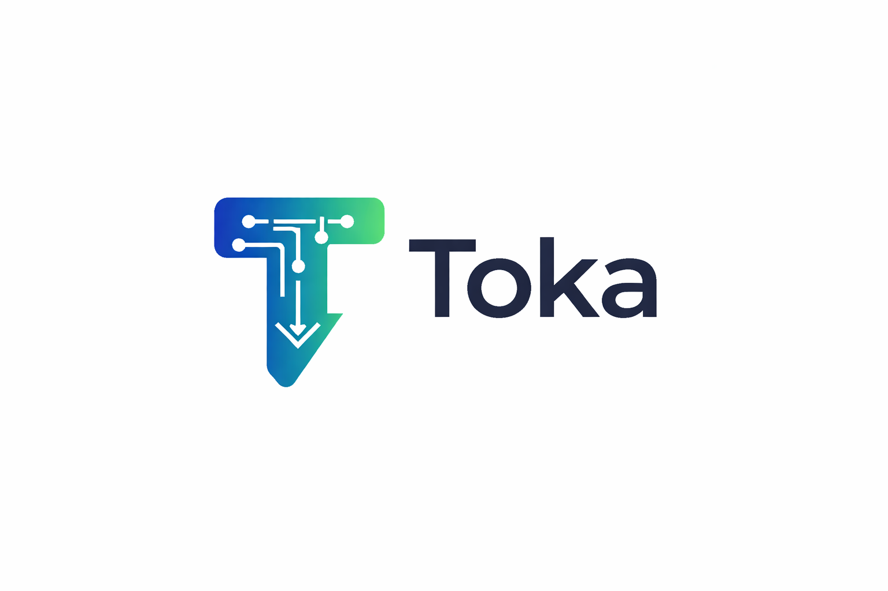

# Toka SDK



**Toka** is an **AI Cost Optimizer SDK** for developers to track token usage, estimate costs in real-time, reduce API spend, and optimize AI model usage. Save money, reduce redundant calls, and gain full visibility into your AI workloads.

---

## Installation

```bash
npm install toka-sdk

```


Quick Start
```bash
import { TokaClient } from 'toka';
```
Initialize the client

```bash
const client = new TokaClient({
  apiKey: process.env.TOKA_API_KEY,
  models: ['gpt-4', 'gpt-4o-mini', 'gpt-3.5'],
  maxCostPerRequest: 0.05,        // Maximum allowed cost per request
  cache: true                     // Enable built-in caching (memory or Redis)
});
```
 Make an API call with cost tracking
 ```bash
const response = await client.chat({
  messages: [{ role: 'user', content: 'Hello world' }]
});

console.log(`Text: ${response.text}`);
console.log(`Cost: $${response.cost}`);
console.log(`Tokens used: ${response.tokens}`);
console.log(`Model used: ${response.modelUsed}`);
console.log(`Cache hit: ${response.cacheHit}`);
```

---

## Features
	•	Token Usage Tracking – Automatically track tokens for every request.
	•	Cost Estimation – Real-time cost estimation per request based on model usage.
	•	Cost Optimization – Intelligent fallback to cheaper models if cost exceeds budget.
	•	Caching – Built-in memory or optional Redis caching to reduce redundant API calls.
	•	Multi-Model Support – Automatic switching between multiple AI models.
	•	Logging & Analytics – Detailed logs for token usage, cost, cache hits, and fallback events.
	•	Optional Enhancements – CLI tool, Dashboard middleware, and Event Hooks for monitoring.

---

## Optional Features
	•	Redis Caching – Scalable caching for high-volume usage.
	•	Dashboard Middleware – Mountable Express middleware for monitoring AI usage and cost.
	•	CLI Tool – Interact with AI APIs directly from your terminal.
	•	Event Hooks – Listen to cache hits, fallback events, and request completions.

---

## Testing
```bash
Run unit tests for all modules:

npm test

```
---

## Contributing

We welcome contributions! Please fork the repo and submit pull requests. For guidelines, see CONTRIBUTING.md.

---

License

MIT License © 2026 Abreham Wondimu Shiferaw

