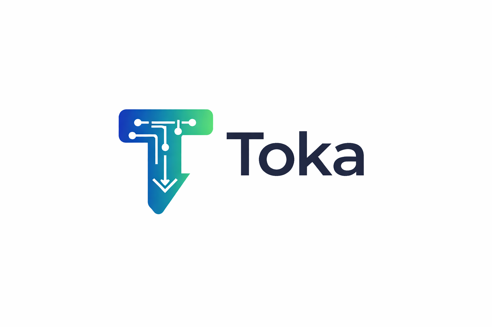

<p align="center"></p>
<h1 align="center">Toka SDK</h1>
<p align="center"><strong>AI cost optimization SDK for developers</strong><br />Track LLM token usage · Estimate API costs · Control budgets · Optimize model usage</p>
<p align="center"><a href="https://github.com/sponsors/abrehamshiferaw">💖 Sponsor Toka</a></p>

## What is Toka?

Toka is a lightweight, developer-first **AI cost optimization SDK** for TypeScript and Node.js applications. It helps teams understand and reduce the cost of OpenAI and other LLM API workloads without sacrificing product quality.

### Why support Toka?

Sponsorship helps fund provider integrations, reliable cost data, tests, documentation, caching improvements, budget controls, and production-ready observability for AI applications.

## Features

- Track token usage for every AI request
- Estimate LLM API costs in real time
- Enforce per-request and application budgets
- Reduce redundant calls with in-memory or Redis caching
- Configure cheaper-model fallback strategies
- Support multi-model AI workflows
- Inspect costs, tokens, cache hits, fallbacks, and model selection

## Installation

```bash
npm install toka-sdk
```

## Quick start

```ts
import { TokaClient } from 'toka-sdk';

const client = new TokaClient({
  apiKey: process.env.TOKA_API_KEY,
  models: ['gpt-4', 'gpt-4o-mini', 'gpt-3.5'],
  maxCostPerRequest: 0.05,
  cache: true
});

const response = await client.chat({
  messages: [{ role: 'user', content: 'Hello world' }]
});

console.log(response.text, response.cost, response.tokens, response.modelUsed);
```

## Ideal for

AI SaaS products, chatbots, LLM-powered web apps, prompt workflows, high-volume AI APIs, and startups monitoring AI infrastructure spend.

## Contributing and sponsorship

Bug reports, provider integrations, documentation, tests, and performance improvements are welcome. If Toka helps your product, please [star the repository](https://github.com/abrehamshiferaw/toka), contribute, or [sponsor Toka](https://github.com/sponsors/abrehamshiferaw).

## License

MIT © 2026 Abreham Wondimu Shiferaw
