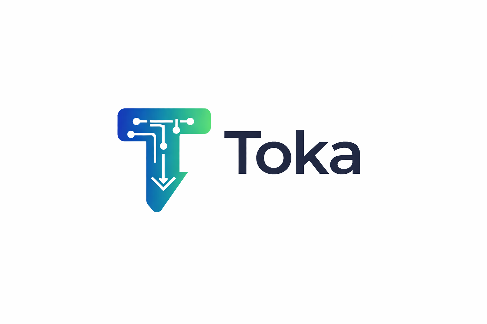

# Toka SDK ⚡

<p align="center">
  
</p>

<p align="center">
  <strong>Production-Grade LLM Cost Control, Smart Model Routing, Multi-Scope Budgets & Observability Architecture</strong>
</p>

<p align="center">
  <a href="https://www.npmjs.com/package/toka-sdk"></a>
  <a href="https://www.npmjs.com/package/toka-sdk"></a>
  <a href="https://github.com/abrehamshiferaw/toka/stargazers"></a>
  <a href="https://github.com/abrehamshiferaw/toka/actions/workflows/ci.yml"></a>
  <a href="https://github.com/sponsors/abrehamshiferaw"></a>
  <a href="https://opensource.org/licenses/MIT"></a>
  <a href="https://www.typescriptlang.org/"></a>
  <a href="https://vercel.com/new/clone?repository-url=https%3A%2F%2Fgithub.com%2Fabrehamshiferaw%2Ftoka"></a>
</p>

---

## 🌟 Why Toka?

AI agents, autonomous coding bots, and LLM applications burn through engineering budgets rapidly due to unbounded loops, unmonitored subagents, and silent model escalations.

**Toka** is a developer-first control plane that sits between your application/agents and LLM providers (**OpenAI, Anthropic Claude, Google Gemini, DeepSeek**). It guarantees strict budget enforcement, eliminates silent downgrades with explainable routing, protects secrets with semantic caching, and provides full OpenTelemetry-compliant observability.

### Key Capabilities

- 💰 **Multi-Scope Budget Engine**: Hierarchical hard/soft limits across Request, Task, Session, Day, Month, and Custom dimensions.
- 🔀 **Explainable Smart Routing**: Policies (`cheapest`, `balanced`, `quality-first`, `strict-model`) with transparent justification logs and zero silent degradation.
- 🚀 **Production Multi-Provider**: Built-in native support for **OpenAI** (`gpt-4o`, `o1`, `o3-mini`), **Anthropic** (`claude-3-5-sonnet`, `claude-3-5-haiku`), **Google Gemini** (`gemini-2.5-flash`, `gemini-2.5-pro`), and **DeepSeek** (`deepseek-chat`, `deepseek-reasoner`).
- ⚡ **Revision-Aware Semantic Caching**: SHA-256 hashed cache keys with repository commit awareness, Redis & Memory adapters, auto-bypass for sensitive PII/secrets.
- 📊 **OpenTelemetry & GenAI Standards**: First-class tracing, structured usage events, CSV/JSON exports, and executive cost summaries.
- 🛡️ **Autonomous Agent Safety**: Human-in-the-loop approval escalation, fallback ladders, and rate-limiting resilience.
- ☁️ **Deploy Anywhere**: Ready for **Vercel** serverless, Node.js microservices, Docker containers, and edge runtimes.

---

## 🚀 One-Click Deploy to Vercel

Deploy the interactive live Toka demo and API directly to Vercel with zero setup:

[](https://vercel.com/new/clone?repository-url=https%3A%2F%2Fgithub.com%2Fabrehamshiferaw%2Ftoka)

Or clone and deploy via Vercel CLI:
```bash
git clone https://github.com/abrehamshiferaw/toka.git
cd toka
npm install
vercel
```

The repo includes a pre-configured `vercel.json` and serverless handler in `api/index.ts` that serves both the interactive management dashboard and the REST API.

---

## 📦 Installation

```bash
# npm
npm install toka-sdk

# yarn
yarn add toka-sdk

# pnpm
pnpm add toka-sdk

# bun
bun add toka-sdk
```

---

## ⚡ 1-Minute Quick Start

```typescript
import { Toka, MultiProvider } from 'toka-sdk';

// Initialize with multi-provider routing (OpenAI, Anthropic, Gemini, DeepSeek)
const toka = new Toka({
  routing: 'balanced', // automatically picks optimal model
  budgets: {
    perRequest: 0.05,  // $0.05 max per single call
    perTask: 0.50,     // $0.50 max per task
    perDay: 10.00,     // $10.00 max daily spend
  },
});

// Autonomous agent execution
const response = await toka.complete({
  model: 'gpt-4o', // preferred model
  messages: [
    { role: 'user', content: 'Analyze this codebase architecture and generate tests.' }
  ],
  agentContext: {
    agentId: 'reviewer-agent-01',
    taskId: 'pr-audit-452',
    stage: 'code-review',
    repository: 'github.com/acme/backend',
  },
});

console.log(`Executed by:  ${response.modelUsed}`);
console.log(`Cost:         $${response.cost.toFixed(6)}`);
console.log(`Routing Why:  ${response.routingDecision?.reason}`);
console.log(`Cache Status: ${response.cached ? 'HIT (Saved $' + response.costSaved + ')' : 'MISS'}`);
```

---

## 🏛️ System Architecture

```
┌────────────────────────────────────────────────────────┐
│               Autonomous Code / AI Agent               │
└───────────────────────────┬────────────────────────────┘
                            │ (AgentContext + Messages)
                            ▼
┌────────────────────────────────────────────────────────┐
│                   Toka Control Engine                  │
│                                                        │
│  [1] Sensitive Data & Key Normalizer                   │
│      ├── Regex PII & Secret Detection                  │
│      └── SHA-256 Commit-Aware Cache Key                │
│                                                        │
│  [2] Semantic & Revision Cache (Redis / In-Memory)     │
│      └── Instant Hit ➔ Returns Cached Response (Free)  │
│                                                        │
│  [3] Multi-Scope Budget Guard                          │
│      ├── Request, Task, Session, Daily, Monthly        │
│      └── Policy: Block | Fallback | Warn | Escalate    │
│                                                        │
│  [4] Transparent Smart Model Router                    │
│      ├── Policies: cheapest | balanced | quality-first │
│      └── Zero Silent Downgrades with Decision Audit    │
│                                                        │
│  [5] Multi-Provider Dispatcher                         │
│      ├── OpenAI (GPT-4o, o1, o3-mini)                  │
│      ├── Anthropic Claude (3.5 Sonnet, 3.5 Haiku)      │
│      ├── Google Gemini (2.5 Flash, 2.5 Pro)            │
│      └── DeepSeek (Chat, Reasoner)                     │
│                                                        │
│  [6] Observability & Analytics Engine                  │
│      ├── OpenTelemetry Semantic GenAI Spans            │
│      ├── Structured UsageEvents & JSON Logger          │
│      └── Multi-Dimensional Cost Aggregation            │
└───────────────────────────┬────────────────────────────┘
                            │
                            ▼
┌────────────────────────────────────────────────────────┐
│             Real Production LLM Providers              │
│       OpenAI  •  Anthropic  •  Gemini  •  DeepSeek     │
└────────────────────────────────────────────────────────┘
```

---

## 🤖 Real Production AI Providers

Toka includes production-tested adapters with built-in retries, exponential backoff, rate-limit header parsing, and timeout controls:

### OpenAI
```typescript
import { Toka, OpenAIProvider } from 'toka-sdk';

const toka = new Toka({
  provider: new OpenAIProvider({
    apiKey: process.env.OPENAI_API_KEY,
    timeoutMs: 30_000,
  }),
});
```

### Anthropic Claude
```typescript
import { Toka, AnthropicProvider } from 'toka-sdk';

const toka = new Toka({
  provider: new AnthropicProvider({
    apiKey: process.env.ANTHROPIC_API_KEY,
  }),
});
```

### Google Gemini
```typescript
import { Toka, GeminiProvider } from 'toka-sdk';

const toka = new Toka({
  provider: new GeminiProvider({
    apiKey: process.env.GEMINI_API_KEY,
  }),
});
```

### Dynamic MultiProvider
```typescript
import { Toka, MultiProvider } from 'toka-sdk';

// Routes gpt-* to OpenAI, claude-* to Anthropic, gemini-* to Gemini, deepseek-* to DeepSeek
const toka = new Toka({
  provider: new MultiProvider({
    openaiOptions: { apiKey: process.env.OPENAI_API_KEY },
    anthropicOptions: { apiKey: process.env.ANTHROPIC_API_KEY },
    geminiOptions: { apiKey: process.env.GEMINI_API_KEY },
    deepseekOptions: { apiKey: process.env.DEEPSEEK_API_KEY },
  }),
});
```

---

## 🧭 Smart Model Routing Policies

| Policy | Behavior | Ideal Use Cases |
|---|---|---|
| `strict-model` | Strictly enforces requested model; errors out if unsupported. | Production compliance, critical regressions. |
| `cheapest` | Selects lowest-cost model meeting minimum context and capability requirements. | Data extraction, summarization, linting, categorization. |
| `balanced` | Balances frontier intelligence with cost efficiency (e.g. `gpt-4o-mini`, `claude-3-5-haiku`). | Interactive coding agents, debugging, discovery. |
| `quality-first` | Selects top frontier models (e.g. `gpt-4o`, `claude-3-5-sonnet`, `gemini-2.5-pro`). | Complex system architecture, security auditing, refactoring. |

Every response includes complete routing transparency:
```json
{
  "requestedModel": "gpt-4o",
  "selectedModel": "claude-3-5-haiku",
  "policy": "balanced",
  "reason": "Model selected to balance quality and token cost within budget limits",
  "estimatedCost": 0.0014,
  "costSavings": 0.0086
}
```

---

## 💰 Multi-Scope Budget Guard

Prevent agent runaway spending across multi-agent pipelines:

```typescript
const toka = new Toka({
  budgets: {
    perRequest: 0.10,   // Max $0.10 per call
    perTask: 1.00,      // Max $1.00 per task run
    perSession: 5.00,   // Max $5.00 for the user session
    perDay: 50.00,      // Max $50.00 organizational daily cap
    custom: {
      'ci-pipeline': 2.00,
    },
    action: 'block',    // 'block' | 'fallback' | 'warn' | 'approval'
  },
});
```

---

## ⚡ Production Caching with Redis & Memory

Save up to 80% on repetitive LLM calls during agent execution:

```typescript
import { Toka, RedisCache } from 'toka-sdk';

const cache = new RedisCache({
  host: process.env.REDIS_HOST || 'localhost',
  port: 6379,
  ttlSeconds: 86400, // 24 hours
});

const toka = new Toka({ cache });

// Cache keys are Git commit and repository aware!
const result = await toka.complete({
  model: 'gpt-4o',
  messages: [{ role: 'user', content: 'Explain this function.' }],
  metadata: {
    repository: 'abrehamshiferaw/toka',
    commitSha: '988a2d3',
  },
});
```

---

## 📊 Observability & OpenTelemetry

Export metrics and trace agent runs directly to your telemetry backend:

```typescript
// Listen to live usage events
toka.on('usage', (event) => {
  console.log(`[Usage] Model: ${event.actualModel} | Spent: $${event.cost.totalCost.toFixed(6)}`);
});

// Listen to budget warnings
toka.on('budgetWarning', (warning) => {
  console.warn(`[Alert] ${warning.scope} exceeded 80% of limit!`);
});

// Generate and export cost reports
const report = toka.generateReport();
console.log(toka.formatReportTable());

// Export JSON or CSV for analytics dashboards
const jsonReport = toka.exportJson();
const csvReport = toka.exportCsv();
```

---

## 🛠️ CLI Toolkit

```bash
# Display model registry with pricing and context limits
npx toka models

# Run full system diagnostics
npx toka check

# Test routing decision explanations
npx toka route --model gpt-4o --policy cheapest

# Generate visual terminal table from event log
npx toka report events.json
```

---

## 🏆 Comparison: Toka vs Others

| Feature | Toka SDK | LangChain | LiteLLM | Portkey |
|---|:---:|:---:|:---:|:---:|
| **Agent Multi-Scope Budgets** | ✅ **Native** | ❌ No | ⚠️ Basic | ⚠️ Cloud Only |
| **Commit-Aware Caching** | ✅ **Native** | ❌ No | ❌ No | ❌ No |
| **Zero Silent Downgrade Guarantee** | ✅ **Yes** | ❌ No | ❌ No | ❌ No |
| **OpenTelemetry GenAI Spans** | ✅ **Native** | ⚠️ Partial | ⚠️ Partial | ⚠️ Cloud |
| **Multi-Provider (OpenAI/Anthropic/Gemini/DeepSeek)** | ✅ **Native** | ✅ Plugin | ✅ Proxy | ✅ Cloud |
| **Vercel Serverless Ready** | ✅ **1-Click** | ⚠️ Complex | ❌ Python/Proxy | ❌ Cloud |
| **100% Open-Source TypeScript** | ✅ **Yes** | ⚠️ Bulky | ❌ Python | ❌ Proprietary |

---

## 💖 Sponsoring Toka

Toka is an open-source initiative dedicated to democratizing cost transparency and autonomous agent safety.

If Toka saved your company money or powered your product:
- ⭐ **Star this repository** on GitHub!
- 💖 **[Sponsor on GitHub](https://github.com/sponsors/abrehamshiferaw)** to support ongoing feature development, new model adapters, and enterprise tools.

---

## 🤝 Contributing

Contributions are warmly welcomed! Please read our [CONTRIBUTING.md](CONTRIBUTING.md) and [CODE_OF_CONDUCT.md](CODE_OF_CONDUCT.md) before submitting a pull request.

---

## 📄 License

MIT © [Abreham Wondimu Shiferaw](https://github.com/abrehamshiferaw/toka)
